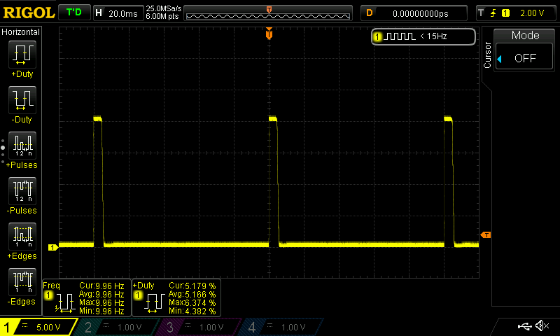

# TS100_NG

Alternative firmware for TS100 soldering iron.

Forked from [Ralim/ts100](https://github.com/Ralim/ts100).

## Goals
* Better and stable control loop(mostly done)
* some sort of autotune/dynamic adjustment for varying input voltages
* clean and maintainable code style

## PWM implementation details
PWM frequency: 10 Hz  
Temperature measurement is done synchronus at the end of the PWM low phase.
Picture below:  
Iron is idle at setpoint temperature.(see statistics display in the picture)
